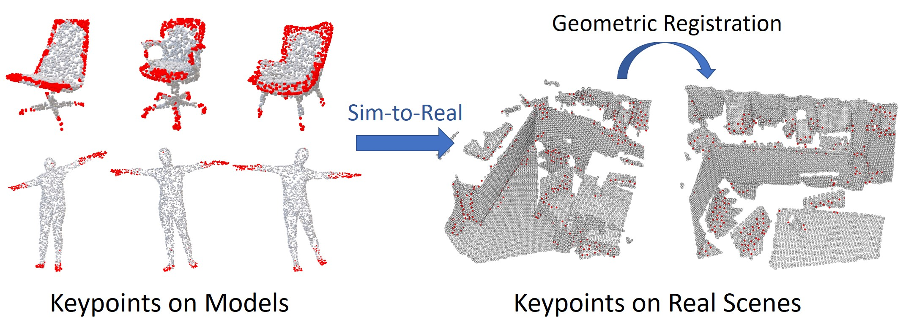

<h1 align="center">
UKPGAN: A General Self-Supervised Keypoint Detector
</h1>

<p align='center'>
 </img>
</p>

<div align="center">
<h3>
<a href="https://qq456cvb.github.io">Yang You</a>, Wenhai Liu, Yanjie Ze, Yong-Lu Li, Weiming Wang, Cewu Lu
<br>
<br>
CVPR 2022
<br>
<br>
<a href='https://arxiv.org/pdf/2011.11974.pdf'>
  
</a>
<a href='https://qq456cvb.github.io/projects/ukpgan'>
  
</a>
  <!-- <a href='https://colab.research.google.com/'>
    
  </a> -->
<br>
</h3>
</div>
 
UKPGAN is a **self-supervised** 3D keypoint detector on both rigid/non-rigid objects and real scenes. Note that our keypoint detector solely depends on local features and is both translational and rotational invariant.
  
# Contents
- [Overview](#overview)
- [Installation](#installation)
- [Train on ShapeNet Models](#train-on-shapenet-models)
- [Test on ShapeNet Models](#test-on-shapenet-models)
- [Related Projects](#related-projects)
- [Citation](#citation)
# Overview
This repo is a TensorFlow implementation of our work UKPGAN. 
  
# Installation
<details>
<summary><b>Create Conda Environments</b></summary>

```
conda env create -f environment.yml
```
</details>
<details>
<summary><b>Compile smoothed density value (SDV) source files</b></summary>

First install [Pybind11](https://pybind11.readthedocs.io/en/latest/) and [PCL](https://github.com/PointCloudLibrary/pcl) C++ dependencies. Then run the following command to build the SDV feature extractor:

```
cd sdv_src
mkdir build
cd build
cmake .. -DCMAKE_BUILD_TYPE=Release
make
cd ../..
```
</details>

# Train on ShapeNet Models
<details>
<summary><b>Prepare Data</b></summary>

Download ShapeNet point clouds from [KeypointNet](https://github.com/qq456cvb/KeypointNet) and unzip **pcds** folder to the root.
</details>
<details>
<summary><b>Category Configuration</b></summary>

Change the category name ``cat_name`` to what you want in ``config/config.yaml``.
</details>
<details>
<summary><b>Start Training</b></summary>

Open a separate terminal to monitor training process:

```
visdom -port 1080
```
Then run:
```
python train.py
```
</details>

# Test on ShapeNet Models
<details>
<summary><b>Evaluate IoU</b></summary>

Once trained, to evaluate the IoU with human annotations, first download [KeypointNet](https://github.com/qq456cvb/KeypointNet) data (you may only download the category that you wish to evaluate), then run
```
python eval_iou.py
```
and modify ``kpnet_root`` and ``cat_name`` variables when necessary.
</details>

# Test on SMPL Models
Coming soon.

## Tracking SMPL Human Bodies with Keypoints
Coming soon.

# Registration on Real-world Scenarios
Coming soon.

# Related Projects
- [KeypointNet: A Large-scale 3D Keypoint Dataset Aggregated from Numerous Human Annotations](https://github.com/qq456cvb/KeypointNet)
- [TopNet: Structural Point Cloud Decoder](https://github.com/lynetcha/completion3d)
- [The Perfect Match: 3D Point Cloud Matching with Smoothed Densities](https://github.com/zgojcic/3DSmoothNet)
# Citation
If you find our algorithm useful in your research, please consider citing:
```
@inproceedings{you2022ukpgan,
  title={UKPGAN: A General Self-Supervised Keypoint Detector},
  author={You, Yang and Liu, Wenhai and Ze, Yanjie and Li, Yong-Lu and Wang, Weiming and Lu, Cewu},
  booktitle={Proceedings of the IEEE/CVF Conference on Computer Vision and Pattern Recognition},
  year={2022}
}
```
